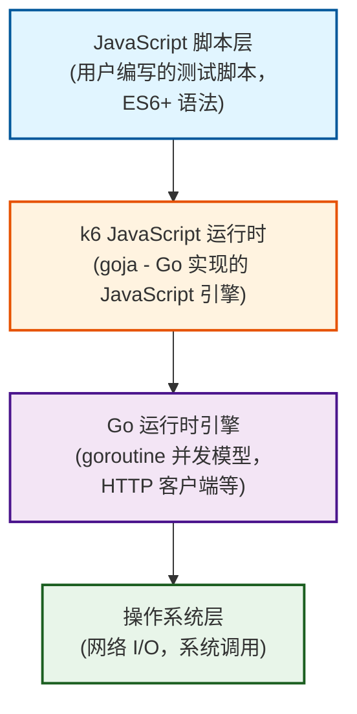
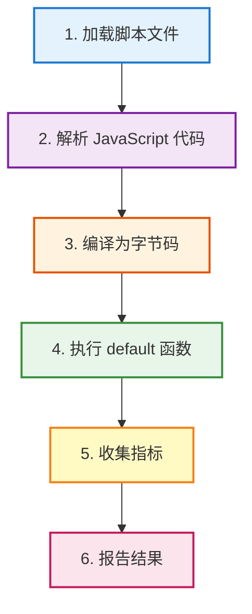
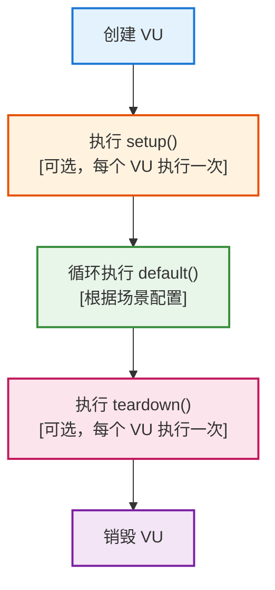
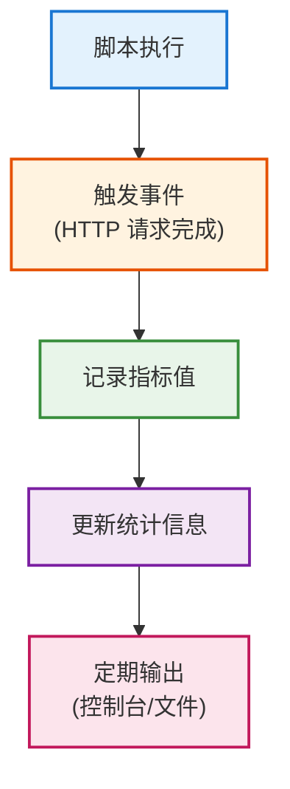

# k6 核心原理

## k6 的架构设计

### 整体架构

k6 采用**分层架构设计**，主要包含以下几个层次：



### 核心组件

1. **JavaScript 运行时（goja）**
   - 基于 Go 实现的 JavaScript 引擎
   - 支持 ES6+ 语法
   - 高性能执行

2. **Go 运行时引擎**
   - goroutine 并发模型
   - HTTP 客户端（基于 net/http）
   - 指标收集系统

3. **调度器（Scheduler）**
   - 虚拟用户调度
   - 场景执行控制
   - 资源管理

## Go 语言运行时的优势

### 为什么选择 Go？

**1. 并发模型优势**

Go 的 goroutine 是**轻量级线程**：
- 创建成本低：~2KB 内存
- 调度高效：M:N 调度模型
- 无需锁：通过 channel 通信

**对比传统线程**：
- Java 线程：~1MB 内存
- 系统线程：创建和切换成本高

**2. 内存管理**

Go 的垃圾回收器（GC）：
- 低延迟 GC
- 自动内存管理
- 内存占用可控

**3. 编译型语言**

- 直接编译为机器码
- 无需运行时环境（JVM）
- 启动速度快

### 性能优势体现

**单机并发能力**：
```
k6 (Go):     10,000+ VU
JMeter (Java): 500-1,000 线程
```

**内存占用**（100 并发）：
```
k6:      ~80-150 MB
JMeter:  ~300-500 MB
```

**启动时间**：
```
k6:      <1 秒
JMeter:  5-15 秒（JVM 预热）
```

## JavaScript 脚本执行机制

### goja 引擎

k6 使用 **goja**（Go 实现的 JavaScript 引擎）来执行用户脚本。

**特点**：
- 完全兼容 ES5.1 标准
- 支持大部分 ES6+ 特性
- 高性能执行
- 与 Go 代码无缝集成

### 脚本执行流程



### 执行上下文

每个虚拟用户（VU）有独立的执行上下文：
- 独立的变量作用域
- 独立的 HTTP 客户端
- 独立的 Cookie 存储

## 虚拟用户（VU）的实现原理

### VU 概念

**虚拟用户（Virtual User, VU）**是 k6 中的核心概念，代表一个并发执行的测试脚本实例。

### VU 生命周期



### VU 实现机制

**底层实现**：
- 每个 VU 对应一个 goroutine
- 独立的 JavaScript 执行上下文
- 独立的 HTTP 客户端连接池

### VU 调度

**调度器负责**：
- 创建和销毁 VU
- 控制 VU 数量
- 管理 VU 生命周期
- 分配资源

## 事件循环与并发模型

### Go 的并发模型

k6 利用 Go 的 **goroutine** 实现高并发：

**goroutine 特点**：
- 轻量级：创建成本低
- 高效调度：Go 运行时调度器
- 无需锁：通过 channel 通信

### 并发执行示例

```javascript
// 用户脚本
export default function () {
  http.get('https://api.example.com');
}

// 底层实现（简化）
// 每个 VU 在独立的 goroutine 中执行
for i := 0; i < vuCount; i++ {
    go func(vuID int) {
        runtime.Run(defaultFunction)
    }(i)
}
```

### 网络 I/O 处理

**非阻塞 I/O**：
- Go 的 net/http 使用非阻塞 I/O
- goroutine 在等待 I/O 时让出 CPU
- 高并发下 CPU 利用率高

**连接池管理**：
- 每个 VU 有独立的连接池
- 连接复用
- 自动管理连接生命周期

## 内存管理与资源优化

### 内存分配策略

**1. 对象池（Object Pool）**
- HTTP 请求对象复用
- 减少 GC 压力
- 提高性能

**2. 零拷贝技术**
- 响应体直接传递
- 减少内存拷贝
- 降低内存占用

**3. 延迟分配**
- 按需创建对象
- 减少初始内存占用

### 内存优化技巧

**在脚本中**：
```javascript
// 使用 SharedArray 共享数据
import { SharedArray } from 'k6/data';
const data = new SharedArray('data', function () {
  return JSON.parse(open('./large-data.json'));
});

// 及时释放大对象
let largeData = fetchLargeData();
processData(largeData);
largeData = null;  // 帮助 GC
```

### GC 调优

Go 的 GC 参数可以通过环境变量调整：
```bash
GOGC=100 k6 run script.js  # 默认值
GOGC=50 k6 run script.js   # 更频繁的 GC，内存占用更低
```

## 指标收集与统计机制

### 指标类型

k6 支持多种指标类型：

**1. Counter（计数器）**
- 累计值，只增不减
- 例如：总请求数

**2. Rate（速率）**
- 0-1 之间的比率
- 例如：成功率、失败率

**3. Trend（趋势）**
- 数值序列，可计算统计值
- 例如：响应时间（可计算 p95、p99 等）

**4. Gauge（仪表盘）**
- 当前值，可增可减
- 例如：当前活跃 VU 数

### 指标收集流程



### 统计计算

**实时统计**：
- 使用高效的统计算法
- 支持分位数计算（p50, p95, p99）
- 内存占用可控

**示例**：
```javascript
// 响应时间统计
http_req_duration: {
    min: 120ms,
    max: 450ms,
    avg: 234ms,
    med: 220ms,
    p(90): 350ms,
    p(95): 380ms,
    p(99): 420ms
}
```

## HTTP 客户端实现

### 基于 Go 的 net/http

k6 的 HTTP 客户端基于 Go 标准库 `net/http`：

**优势**：
- 成熟稳定
- 性能优秀
- 支持 HTTP/1.1 和 HTTP/2
- 自动连接复用

### 连接管理

**连接池**：
- 每个 VU 有独立的连接池
- 自动复用连接
- 支持 Keep-Alive

**连接数控制**：
```javascript
export const options = {
  // 限制每个 VU 的最大连接数
  httpReq: {
    maxConnections: 10,
  },
};
```

### 超时控制

**多级超时**：
- 连接超时
- 请求超时
- 响应超时

```javascript
const response = http.get('https://api.example.com', {
  timeout: '10s',  // 总超时时间
});
```

## 性能优化原理

### 为什么 k6 性能高？

**1. 编译型语言**
- 直接编译为机器码
- 无需解释执行
- 启动速度快

**2. 高效的并发模型**
- goroutine 轻量级
- 高并发能力
- CPU 利用率高

**3. 优化的网络 I/O**
- 非阻塞 I/O
- 连接复用
- 零拷贝技术

**4. 高效的内存管理**
- GC 优化
- 对象池
- 延迟分配

### 性能瓶颈分析

**CPU 瓶颈**：
- JavaScript 执行
- 网络 I/O 处理
- 指标统计计算

**内存瓶颈**：
- VU 数量
- 响应体大小
- 数据文件大小

**网络瓶颈**：
- 带宽限制
- 连接数限制
- 服务器处理能力

## 总结

k6 的核心原理可以总结为：

1. **架构设计**：分层架构，职责清晰
2. **Go 运行时**：高效的并发模型和内存管理
3. **JavaScript 引擎**：goja 提供脚本执行能力
4. **VU 机制**：轻量级虚拟用户实现高并发
5. **指标系统**：高效的指标收集和统计

理解这些原理有助于：
- 编写高效的测试脚本
- 优化测试性能
- 解决性能问题
- 深入理解 k6 的工作机制


